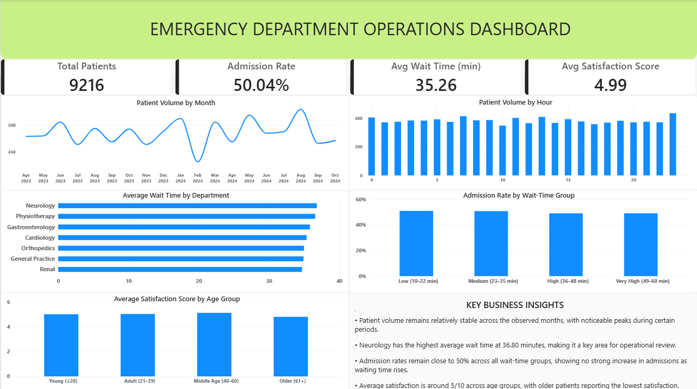

Healthcare Operations
Emergency Department Operations Analysis
> **How efficiently is the emergency department handling patient flow, and where are the major bottlenecks affecting waiting time, admissions, and patient satisfaction?**
This project analyzes 9,216 emergency department patient records to understand patient flow, admission patterns, waiting times, referral activity, demand patterns, and patient satisfaction.
The analysis combines Python/Pandas for data preparation, PostgreSQL for business-focused SQL analysis, and Power BI for dashboard reporting.
The objective was to move beyond basic visualization and use operational data to identify patterns that can support decisions around capacity planning, waiting-time management, staffing, referrals, and patient experience.
---
📌 Project Snapshot
Metric	Value
Patient Records	9,216
Data Fields	12
Admitted Records	4,612
Non-Admitted Records	4,604
Overall Admission Rate	50.04%
Average Wait Time	35.26 min
Average Satisfaction Score*	4.99 / 10
Data Period	Apr 2023 – Oct 2024
> *Satisfaction is calculated only from records where a satisfaction score was available.*
---
🏥 Business Problem
Emergency departments need to balance patient demand, waiting times, admissions, referrals, and patient experience.
A total patient count alone does not explain where operational pressure exists. This project therefore examines multiple dimensions of emergency department operations:
Patient volume — How much demand is being handled?
Admissions — What proportion of records result in admission?
Waiting time — How long are patients waiting?
Referral activity — Which departments receive the most referrals?
Operational delays — Which referred departments have higher average wait times?
Patient groups — How do admission rates and satisfaction vary across age groups?
Demand timing — When does patient volume peak?
Wait vs. admission — Does longer waiting appear to correspond with higher admission rates?
---
❓ Key Business Questions
The analysis was structured around the following 10 business questions:
How many patients visited the emergency department in total?
How many patients were admitted vs. not admitted?
What is the average patient wait time overall, and how does it differ between admitted and non-admitted patients?
What is the patient volume by month?
Which departments receive the most patient referrals?
Which age groups have the highest number of patients and admission rates?
Which departments have the highest average patient wait time?
Does longer waiting time appear to be associated with a higher admission rate?
How does patient satisfaction vary across different age groups?
When does the emergency department experience the highest patient demand, and do those periods also have longer waiting times?
---
📊 Dataset
The dataset contains 9,216 emergency department patient records across 12 fields.
Key Fields
Field	Description
`patient_id`	Patient record identifier
`patient_admission_date`	Date and time of the emergency department visit
`patient_gender`	Recorded gender
`patient_age`	Patient age
`patient_race`	Recorded race category
`department_referral`	Referred department, where recorded
`patient_admission_flag`	Whether the patient was admitted
`patient_satisfaction_score`	Patient satisfaction score
`patient_waittime`	Patient waiting time in minutes
`patients_cm`	Binary field included in the source dataset
The dataset covers visits from April 2023 through October 2024.
---
🧹 Data Quality & Preparation
The dataset was first inspected and prepared using Python and Pandas before being loaded into PostgreSQL.
Preparation Performed
Standardized column names by converting them to lowercase and replacing spaces with underscores.
Converted `patient_admission_date` from text into a proper datetime field.
Created a combined `patient_name` field from the first initial and last name.
Checked for duplicate records.
Reviewed categorical distributions.
Checked missing values.
Reviewed numerical ranges and descriptive statistics.
Investigated whether missing referral and satisfaction values showed an obvious relationship with admission status.
Data Quality Findings
There were no duplicate rows in the dataset.
Two fields contained substantial missing values:
Field	Missing Records
`department_referral`	5,400
`patient_satisfaction_score`	6,699
Instead of blindly imputing these values, the missingness was investigated.
For satisfaction scores, the available values were compared across admitted and non-admitted records. Since the available scores did not show a meaningful difference based on admission status, missing satisfaction values were retained as missing rather than estimated.
Missing referral values were also retained. A missing referral was not automatically interpreted as "not referred," because the dataset does not establish that assumption.
This approach keeps the analysis closer to the information actually recorded in the source data.
---
🗄️ SQL Analysis
After preparation, the dataset was loaded into PostgreSQL and analyzed using SQL.
The SQL analysis focused on five major areas.
1. Patient Volume & Admissions
Total patient records
Admitted vs. non-admitted records
Overall average waiting time
Average waiting time by admission status
2. Demand Patterns
Monthly patient volume
Hourly patient volume
Average wait time by hour
3. Referral Operations
Referral volume by department
Average waiting time by referred department
4. Patient Groups
Age-group patient volume
Age-group admission rates
Age-group satisfaction scores
5. Wait-Time Analysis
Patients were divided into four wait-time groups using `NTILE(4)` and admission rates were compared across those groups.
This allowed the analysis to compare similarly sized groups without introducing arbitrary wait-time boundaries.
---
📈 Power BI Dashboard
The final analysis was presented through a single-page Emergency Department Operations Dashboard.
Dashboard Title
Emergency Department Operations Dashboard
Subtitle
Patient Flow, Operational Efficiency & Patient Experience
KPI Cards
The dashboard provides four headline KPIs:
Total Patients
Admission Rate
Avg Wait Time (min)
Avg Satisfaction Score
Main Visuals
Visual	Purpose
Patient Volume by Month	Track changes in demand over time
Patient Volume by Hour	Identify periods of higher patient demand
Average Wait Time by Department	Highlight departments with higher average waits
Admission Rate by Wait-Time Group	Examine the relationship between waiting time and admissions
Average Satisfaction Score by Age Group	Compare patient experience across age groups
The dashboard was intentionally kept focused rather than filling the page with unnecessary visuals.
---
🖼️ Dashboard Preview

---
💡 Key Business Insights
1. Patient volume remains relatively consistent across the observed period
Monthly patient volume stays within a relatively narrow range, although some months show noticeable increases.
Highest monthly volume: August 2024 — 530 records
Lowest monthly volume: February 2024 — 431 records
This indicates that demand varies by month but does not appear to be dominated by one extreme period.
2. Admissions are almost evenly split with non-admissions
Out of 9,216 patient records:
4,612 were admitted
4,604 were not admitted
The resulting admission rate is approximately 50.04%.
3. Average waiting time is approximately 35 minutes
The overall average wait time is 35.26 minutes.
By admission status:
Admission Status	Average Wait
Admitted	34.97 min
Not Admitted	35.55 min
The difference is small, so admission status alone does not show a substantial difference in average waiting time.
4. Neurology has the highest average wait among referred departments
Among records with a recorded department referral, Neurology has the highest average wait time at approximately 36.80 minutes.
Department	Average Wait
Neurology	36.80 min
Physiotherapy	36.57 min
Gastroenterology	35.83 min
Cardiology	35.35 min
Orthopedics	34.98 min
General Practice	34.91 min
Renal	34.70 min
Neurology therefore stands out as an area for further operational review.
5. Longer waits do not consistently correspond with higher admission rates
The wait-time analysis does not show a consistent upward relationship between waiting time and admission rate.
Wait-Time Group	Admission Rate
Low	51.13%
Medium	50.22%
High	47.96%
Very High	50.87%
The highest-wait group does not have the highest admission rate. Therefore, the analysis does not support the assumption that longer waiting automatically corresponds with a higher probability of admission.
> **Important:** This is an observational analysis. It describes the pattern in this dataset and should not be interpreted as a causal relationship.
6. The highest hourly demand occurs at 11 PM
The highest hourly patient volume occurs at 11 PM, with 436 records.
The average wait time during that hour is 36.25 minutes, slightly above the overall average of 35.26 minutes.
This makes late-evening demand a useful area to consider when reviewing staffing and capacity planning.
7. Satisfaction data is incomplete
Only 2,517 of the 9,216 records contain a satisfaction score.
The average satisfaction among records with an available score is 4.99/10.
Across age groups, the oldest group has the lowest average satisfaction at approximately 4.80/10, while the other groups are around 5.02–5.13.
Because most records do not contain satisfaction scores, this should be interpreted as a pattern among available responses rather than a conclusion about all patients.
---
🚀 Business Recommendations
The findings point to several areas that could be investigated further.
1. Review Neurology referral operations
Neurology has the highest average waiting time among referred departments. Operational teams could review referral processing, staffing availability, and handoff times to understand the source of the higher wait.
2. Evaluate late-evening staffing
Patient volume peaks at 11 PM. Comparing staffing levels with hourly demand could help determine whether late-evening capacity is aligned with patient flow.
3. Monitor waiting time independently from admission
Since admission rates do not consistently increase across longer wait-time groups, waiting time should be monitored as a separate operational efficiency metric rather than using admission rate as a proxy for waiting-time pressure.
4. Improve satisfaction data capture
With satisfaction scores available for only 2,517 records, the large amount of missing feedback limits the strength of patient-experience analysis.
Improving feedback collection could provide a more representative view of patient satisfaction.
5. Use demand patterns for capacity planning
Monthly and hourly demand patterns can be monitored to identify periods where staffing and resources may require adjustment.
---
🛠️ Tools Used
Python
Pandas
NumPy
Matplotlib
PostgreSQL / pgAdmin
SQL
Power BI
DAX
Data modeling
KPI cards
Data visualization
GitHub
---
🏁 Project Outcome
This project demonstrates an end-to-end approach to operational data analysis:
Raw Data → Python Data Preparation → PostgreSQL SQL Analysis → Power BI Dashboard → Business Insights → Recommendations
The final result is a focused emergency department operations analysis connecting patient-level records with practical questions around:
Patient Demand • Waiting Time • Admissions • Referrals • Patient Experience
The project demonstrates how data can be transformed from raw patient records into a structured business analysis and an executive-friendly Power BI report.
